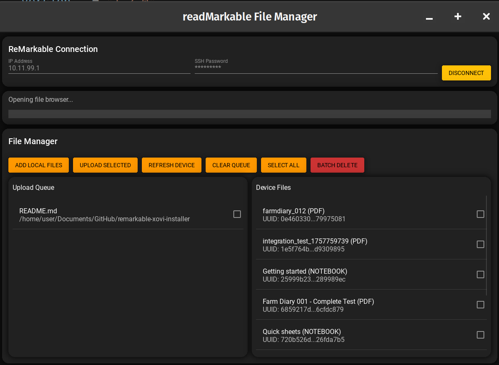

# readmarkable



A GUI application for synchronizing markdown files with reMarkable devices, including automatic PDF conversion and bidirectional file synchronization.

## Features

- **Device Connection**: Connect to reMarkable devices over SSH (USB or WiFi)
- **Markdown Sync**: Bidirectional synchronization of markdown files
- **PDF Conversion**: Automatic conversion of markdown files to PDF using WeasyPrint or ReportLab
- **File Watching**: Real-time monitoring of local directory changes
- **Modern GUI**: Clean interface built with CustomTkinter (falls back to standard Tkinter)
- **Comprehensive Logging**: Detailed logging for debugging and monitoring

## Requirements

- Python 3.8 or higher
- reMarkable device with SSH access enabled
- Network connection to reMarkable (USB cable or WiFi)

## Installation

1. Clone or download the readmarkable project
2. Install dependencies:
   ```bash
   pip install -r requirements.txt
   ```

## Usage

### GUI Mode (Default)
```bash
python main.py
```

### Command Line Options
```bash
python main.py --help                    # Show help
python main.py --debug                  # Enable debug logging
python main.py --config custom.json     # Use custom config file
python main.py --device-ip 10.11.99.1   # Set device IP
python main.py --sync-dir /path/to/md    # Set sync directory
```

## Configuration

The application uses a configuration system that stores settings in JSON format. Default configuration is created automatically on first run.

### Device Settings
- **IP Address**: Your reMarkable device IP (default: 10.11.99.1 for USB)
- **SSH Password**: Found in Settings > Help > About on your reMarkable
- **Connection Timeout**: SSH connection timeout in seconds

### Sync Settings
- **Local Directory**: Local folder containing markdown files
- **Remote Directory**: Target directory on reMarkable device
- **Auto-sync**: Automatically sync when files change
- **PDF Conversion**: Convert markdown files to PDF before upload
- **File Watching**: Monitor local directory for changes

## Project Structure

```
readmarkable/
├── main.py              # Application entry point
├── requirements.txt     # Python dependencies
├── config/
│   └── settings.py      # Configuration management
├── services/
│   ├── network_service.py    # SSH/device connection
│   ├── file_service.py       # File operations and watching
│   └── markdown_service.py   # Markdown processing and PDF conversion
├── models/
│   ├── device.py        # Device connection model
│   └── sync_state.py    # Sync progress tracking
├── gui/
│   ├── main_window.py   # Primary GUI
│   └── components/      # Reusable GUI components
├── utils/
│   ├── logger.py        # Logging system
│   └── validators.py    # Input validation
└── README.md
```

## Getting Started

1. **Enable SSH on reMarkable**: 
   - Go to Settings > Help > About
   - Scroll down and tap on "Copyrights and licenses"
   - In the developer menu, enable SSH
   - Note the SSH password shown

2. **Connect to Device**:
   - Connect reMarkable via USB cable or ensure WiFi connection
   - Launch readmarkable application
   - Enter device IP and SSH password in the Device tab
   - Click Connect

3. **Configure Sync**:
   - Go to the Sync tab
   - Select local directory containing markdown files
   - Configure sync options as desired
   - Click "Start Sync"

## Supported File Types

- **Markdown**: `.md`, `.markdown`, `.mdown`, `.mkd`, `.txt`
- **Output**: PDF files optimized for reMarkable display

## Dependencies

### Core Dependencies
- **customtkinter**: Modern GUI framework
- **paramiko**: SSH client library
- **watchdog**: File system monitoring
- **markdown**: Markdown processing

### PDF Conversion
- **weasyprint**: Advanced PDF generation (recommended)
- **reportlab**: Alternative PDF generation
- **Pillow**: Image processing support

## Troubleshooting

### Connection Issues
- Verify reMarkable IP address (check device settings)
- Ensure SSH is enabled on reMarkable
- Check network connectivity
- Try different SSH password (regenerate if needed)

### Sync Issues
- Check local directory permissions
- Verify remote directory exists and is writable
- Review log output in the Logs tab
- Ensure sufficient storage space on reMarkable

### PDF Conversion Issues
- Install weasyprint for best results: `pip install weasyprint`
- Check markdown file format compatibility
- Review conversion settings in configuration

## Development

This project is built on components adapted from the freeMarkable project, specifically:

- Network service for SSH communication
- Configuration management system
- Logging utilities
- Device connection models

### Key Components

- **NetworkService**: Handles SSH connections and command execution
- **MarkdownService**: Processes markdown and converts to PDF
- **FileService**: Manages file operations and monitoring  
- **Device**: Models reMarkable device state and connection
- **SyncState**: Tracks synchronization progress and file states

## License

This project builds upon components from freeMarkable and follows similar licensing terms.

## Contributing

Contributions are welcome! Please feel free to submit issues, feature requests, or pull requests.

## Support

For issues and support:
1. Check the troubleshooting section above
2. Review log output for error details
3. Submit an issue with relevant log information