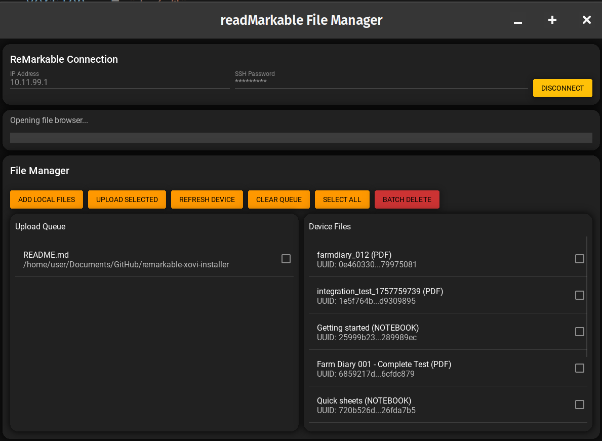

# Sample Document for reMarkable Sync

This is an example markdown document that demonstrates how readmarkable can sync your content to your reMarkable device.

## Features Demonstration

### Text Formatting

You can use **bold text**, *italic text*, and `code snippets` in your markdown files.

### Lists

#### Unordered Lists
- Item 1
- Item 2
  - Sub-item A
  - Sub-item B
- Item 3

#### Ordered Lists
1. First step
2. Second step
3. Third step

### Code Blocks

```python
def hello_remarkable():
    print("Hello, reMarkable!")
    return "Synced successfully"
```

### Quotes

> "The best way to get started is to quit talking and begin doing." - Walt Disney

### Links

For more information, visit the [reMarkable website](https://remarkable.com/).

### Tables

| Feature | Status | Notes |
|---------|--------|-------|
| Markdown Sync | ✅ | Bidirectional sync |
| PDF Conversion | ✅ | Automatic conversion |
| File Watching | ✅ | Real-time monitoring |

## Mathematical Expressions

You can include mathematical expressions (depending on your markdown processor):

- Simple equation: E = mc²
- Inline math: The value of π is approximately 3.14159

## Images



## Conclusion

This document will be converted to PDF and synced to your reMarkable device, preserving the formatting and making it easy to read and annotate on your device.

---

*Generated by readmarkable - Markdown to reMarkable sync tool*